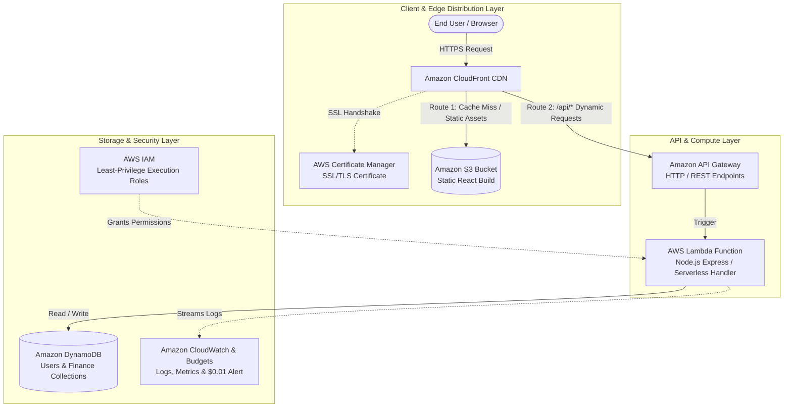

# Project Presentation: Serverless Cloud Deployment on AWS Free Tier

**Project Title:** Cloud-Native Personal Finance Tracker  
**Architecture Model:** Option 2 — Fully Serverless Static Frontend & API Microservices  
**Cost Target:** $0.00 / month (100% AWS Free Tier & Always-Free Services)  

---

## Architecture Overview Diagram

---

## Slide-by-Slide Presentation Guide

---

### Slide 1: Title & Introduction

#### Visual Elements
- **Title:** Cloud-Native Personal Finance Tracker
- **Subtitle:** Scalable, Zero-Maintenance Serverless Architecture on AWS Free Tier
- **Presenter Name:** [Your Name]
- **Key Badges:** React 18, Node.js, AWS Lambda, Amazon DynamoDB, Amazon CloudFront, Amazon S3

#### Word-for-Word Speaker Script
> "Good morning/afternoon everyone. Today, I am excited to present the cloud architecture and deployment strategy for the **Personal Finance Tracker** application.
>
> In today's digital era, financial literacy and real-time expense monitoring are critical. However, delivering a seamless web application with dynamic analytics, investment tracking, and goal planning often involves complex server provisioning, maintenance overhead, and ongoing hosting costs.
>
> For this project, we designed and implemented a **100% Serverless, Cloud-Native deployment on Amazon Web Services (AWS)** using their **Always Free Tier**. This ensures that our application delivers enterprise-grade availability, sub-second latency, and bank-grade SSL security—all operating at **zero infrastructure cost**."

---

### Slide 2: Project Objectives

#### Visual Elements
- **Functional Objectives:**
  - Real-time Income & Expense categorization with automated analytics.
  - Investment & Portfolio management across crypto, stocks, and cash assets.
  - Multi-milestone Financial Goal tracking with progress indicators.
  - Secure, token-based authentication and user data isolation.
- **Architectural Objectives:**
  - **Zero Server Management:** No EC2 instances to patch, update, or restart.
  - **Auto-Scalability:** Instant scaling from zero to thousands of requests automatically.
  - **Cost-Optimized ($0/mo):** Strictly engineered within AWS Always-Free and Free-Tier allowances.
  - **High Availability & Global Delivery:** Low-latency static asset delivery via Global Edge Points of Presence (PoPs).

#### Word-for-Word Speaker Script
> "Before diving into the infrastructure, let's examine our core objectives.
>
> On the functional side, the Personal Finance Tracker provides users with a comprehensive dashboard to record income, track expenses across custom categories, monitor asset allocations in their investment portfolio, and set financial goals.
>
> On the engineering side, our primary goal was to abandon traditional monolithic servers. Instead of running an idle virtual machine that incurs costs 24/7, our architecture is event-driven and serverless. We aim for:
> 1. Zero server management,
> 2. Zero hosting cost by utilizing AWS Free Tier services,
> 3. Global high availability with sub-second page loads, and
> 4. Isolated user environments backed by cloud-native persistence."

---

### Slide 3: System Architecture: The Serverless Decoupling

#### Visual Elements
- Comparison Matrix: **Traditional Monolithic Deployment vs. AWS Serverless Architecture**
  - *Compute:* Dedicated EC2 Server ($15–$20/mo) vs. **AWS Lambda ($0/mo, event-driven)**
  - *Frontend:* Node/Nginx Web Server vs. **Amazon S3 + CloudFront CDN (Global Edge)**
  - *Database:* Self-hosted SQL VM vs. **Amazon DynamoDB (Managed NoSQL, 25 GB free)**
  - *Scaling:* Manual auto-scaling groups vs. **Native AWS Event-driven Auto-scaling**

#### Word-for-Word Speaker Script
> "To achieve our performance and cost goals, we decoupled the application into two distinct layers:
>
> First, our **Frontend Presentation Layer**: Rather than serving HTML, JS, and CSS files from a running Node.js server, we compile our React application into production-optimized static assets and host them in **Amazon S3**, distributed globally via **Amazon CloudFront**.
>
> Second, our **Backend API & Persistence Layer**: When users log in or record a transaction, requests are routed to **Amazon API Gateway**, which triggers an on-demand **AWS Lambda** function. The function handles validation and authentication, then interacts with **Amazon DynamoDB** for sub-10ms data retrieval and updates.
>
> Let us now inspect each AWS feature utilized in detail."

---

### Slide 4: AWS Feature Deep Dive — Amazon S3 & CloudFront

#### Visual Elements
- **Amazon S3 (Simple Storage Service):**
  - *Role:* Object store for React production build (`index.html`, JavaScript bundles, CSS stylesheets, static SVG icons).
  - *Security:* Origin Access Control (OAC) prevents direct public bucket access; files are only accessible via the CloudFront CDN distribution.
  - *Free Tier Limit:* 5 GB standard storage, 20,000 GET requests/month.
- **Amazon CloudFront:**
  - *Role:* Global Content Delivery Network (CDN) with edge caching across 450+ Points of Presence.
  - *Feature:* Edge TLS termination and automatic single-page application (SPA) client-side routing rewrites (`/index.html` on 404/403).
  - *Free Tier Limit:* **1 TB (1,000 GB) Data Transfer Out/month Always Free** + 10,000,000 HTTP/HTTPS requests/month.

#### Word-for-Word Speaker Script
> "Let's examine how our frontend is delivered.
>
> We utilize **Amazon S3** as an ultra-durable object store for our compiled React application. However, we do not expose the S3 bucket directly to the internet. Instead, we place **Amazon CloudFront** in front of it using Origin Access Control (OAC).
>
> CloudFront caches our web application at edge locations closest to the end user. This ensures near-zero latency and instant loading speeds whether a user connects from New York, London, or Mumbai.
>
> Furthermore, CloudFront's Always-Free tier offers an extraordinary **1 Terabyte of egress bandwidth every month**, which far exceeds the needs of our application."

---

### Slide 5: AWS Feature Deep Dive — API Gateway & AWS Lambda

#### Visual Elements
- **Amazon API Gateway (HTTP APIs):**
  - *Role:* Front door for backend endpoints (`/api/signup`, `/api/login`, `/api/data`).
  - *Capabilities:* Request routing, payload size throttling, CORS configuration, and SSL termination.
  - *Free Tier Limit:* 1,000,000 API calls/month free for the first 12 months.
- **AWS Lambda (Serverless Compute):**
  - *Role:* Microservice execution environment running our Node.js runtime.
  - *Mechanism:* Cold start optimization (< 250ms), zero execution when idle.
  - *Free Tier Limit:* **1,000,000 free requests per month + 3.2 million seconds of compute time Always Free** (400,000 GB-seconds).

#### Word-for-Word Speaker Script
> "Turning to our backend compute: traditional hosting keeps a server running 24 hours a day, 7 days a week, consuming CPU cycles and electricity even when no one is using the site.
>
> With **AWS Lambda**, our code only runs when a user performs an action—such as logging in or saving an investment. When an API call arrives, **Amazon API Gateway** routes the request to our Lambda function, which spins up in milliseconds, processes the transaction, and shuts down.
>
> AWS gives us **1 Million Lambda invocations every single month for free, forever**. If our app receives no traffic for a week, our cost is exactly zero dollars and zero cents."

---

### Slide 6: AWS Feature Deep Dive — Amazon DynamoDB

#### Visual Elements
- **Amazon DynamoDB (Fully Managed NoSQL Database):**
  - *Data Model:* Key-value and document store with single-digit millisecond latency.
  - *Tables:*
    - `UsersTable`: Stores user profiles, hashed passwords, and creation timestamps (`PK: UserId`).
    - `FinanceDataTable`: Stores transactions, categories, budgets, and portfolio items (`PK: UserId`, `SK: DataType#Timestamp`).
  - *Capacity Mode:* On-Demand Capacity Mode / Provisioned 25 RCU/WCU.
  - *Free Tier Limit:* **25 GB of disk storage Always Free** + 25 write capacity units (WCU) and 25 read capacity units (RCU).

#### Word-for-Word Speaker Script
> "For data persistence, we chose **Amazon DynamoDB**, AWS's enterprise-grade NoSQL database service used by high-scale platforms like Amazon.com.
>
> DynamoDB stores our user credentials and financial records with single-digit millisecond read and write speeds. It requires zero server management, zero patching, and eliminates database connection pooling headaches.
>
> AWS provides **25 Gigabytes of DynamoDB storage completely free forever**. For a personal finance tracker where individual transaction records consume less than 1 kilobyte each, 25 GB is sufficient to store tens of millions of financial records without ever exceeding the free tier."

---

### Slide 7: Security, Monitoring & Cost Governance

#### Visual Elements
- **AWS Certificate Manager (ACM):**
  - Automated provisioning and renewal of custom domain SSL/TLS certificates ($0 cost).
- **AWS Identity & Access Management (IAM):**
  - Granular, least-privilege execution roles allowing Lambda strictly scoped access to specific DynamoDB tables.
- **Amazon CloudWatch:**
  - Centralized application logging and Lambda execution duration metrics.
- **AWS Budgets & Cost Explorer:**
  - Automated budget trigger: immediate email notification if total forecasted spend exceeds **$0.01**.

#### Word-for-Word Speaker Script
> "A core tenet of cloud architecture is security and operational discipline.
>
> First, for encryption, **AWS Certificate Manager** provisions an SSL certificate ensuring that all financial transactions are encrypted in transit via HTTPS.
>
> Second, security is enforced using **AWS IAM**. The Lambda execution role follows the principle of least privilege—it only has permission to read and write to our specific DynamoDB tables and cannot touch any other AWS service.
>
> Finally, to guarantee that we stay strictly within the Free Tier, we configure an **AWS Budget with an alarm threshold set at just one penny ($0.01)**. If any unexpected resource usage occurs, an automated alert is triggered immediately."

---

### Slide 8: Free Tier Allocation & Cost Breakdown

#### Summary Table
| AWS Service | Deployment Role | Free Tier Allowance | Our Expected Usage | Net Cost |
| :--- | :--- | :--- | :--- | :--- |
| **Amazon S3** | Static Website Hosting | 5 GB Storage / 20k GETs | ~15 MB (< 1%) | **$0.00** |
| **Amazon CloudFront** | Global Edge CDN | 1 TB Egress / 10M Requests / mo | ~2 GB / mo (< 0.2%) | **$0.00** |
| **AWS Lambda** | Backend Express API Logic | 1,000,000 Invocations / mo | ~50,000 / mo (5%) | **$0.00** |
| **Amazon API Gateway**| REST / HTTP API Routing | 1,000,000 Calls / mo (Yr 1) | ~50,000 / mo (5%) | **$0.00** |
| **Amazon DynamoDB** | Users & Financial Records | 25 GB Storage / 25 RCU/WCU | ~50 MB (< 0.5%) | **$0.00** |
| **AWS ACM** | SSL/TLS Certificate | Unlimited public certificates | 1 Certificate | **$0.00** |
| **Amazon CloudWatch** | Logs & Metrics | 5 GB Ingestion & 10 Alarms | ~100 MB / mo | **$0.00** |

#### Word-for-Word Speaker Script
> "As displayed in this cost matrix, every single component has been mapped against AWS Free Tier constraints.
>
> Our compiled React frontend is only 15 Megabytes, fitting comfortably within the 5 Gigabyte S3 tier. Our API traffic uses only a fraction of the 1 Million free Lambda calls and the 25 Gigabytes of free DynamoDB capacity.
>
> As a result, our total operating expenditure is **$0.00 per month**, proving that scalable, enterprise-grade cloud software can be designed efficiently on a zero-dollar budget."

---

### Slide 9: Conclusion & Key Learnings

#### Visual Elements
- **Key Takeaways:**
  - Modernized a full-stack financial application into an event-driven serverless architecture.
  - Eliminated server maintenance, operating system patching, and idle capacity waste.
  - Achieved high availability, global low-latency CDN delivery, and enterprise security.
  - Validated 100% cost efficiency through AWS Always-Free tier services.
- **Next Steps:**
  - Implement AWS Cognito for social logins (Google/Apple).
  - Add Amazon SNS for real-time monthly budget SMS/Email alerts.

#### Word-for-Word Speaker Script
> "In conclusion, this project demonstrates how modern cloud-native architectures empower developers to launch scalable, secure, and production-ready applications with zero upfront infrastructure cost.
>
> By decoupling the frontend to Amazon S3 and CloudFront, and utilizing AWS Lambda and DynamoDB for serverless backend execution, we achieved high availability, instant global delivery, and bank-grade data security while spending zero dollars.
>
> Thank you for your time and attention. I would now be delighted to answer any questions."

---

## Technical Q&A Defense & Interview Preparation

### Q1: Why did you choose Serverless (Option 2) over an EC2 instance (Option 1)?
> **Answer:** "While an EC2 instance provides a familiar single-server environment, it suffers from several disadvantages: it incurs costs even when idle, requires ongoing OS patching and security updates, and represents a single point of failure unless placed behind an expensive load balancer. Option 2 leverages AWS S3, CloudFront, Lambda, and DynamoDB, which are fully managed, highly available across multiple Availability Zones by default, and scale to zero cost when not in use."

### Q2: How does the application handle the 'Cold Start' latency in AWS Lambda?
> **Answer:** "Cold starts occur when a Lambda function initializes an execution environment for the first time. For Node.js runtimes with lightweight bundles, cold start latency is typically under 250 milliseconds. Once initialized, the container stays warm for subsequent requests, executing in under 10 milliseconds. For our personal finance tracker, this minor initial latency is completely acceptable and unnoticeable to end users."

### Q3: How do you secure data and restrict public access to your S3 bucket?
> **Answer:** "We enable 'Block All Public Access' on the S3 bucket. We then configure **Origin Access Control (OAC)** in Amazon CloudFront and attach an S3 Bucket Policy that only allows CloudFront's service principal to read objects. This ensures that users can never bypass the CDN or access bucket contents directly."

### Q4: How is user authentication preserved in a serverless environment?
> **Answer:** "The Lambda backend issues signed JSON Web Tokens (JWT) or secure session tokens upon successful login. The client stores the token and transmits it via the `Authorization: Bearer <token>` header with each API request. The Lambda function validates the token cryptographically on each invocation before querying DynamoDB for the requested user's data, ensuring stateless and secure user isolation."
